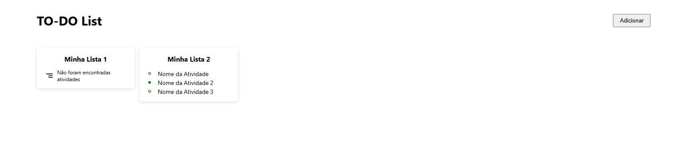
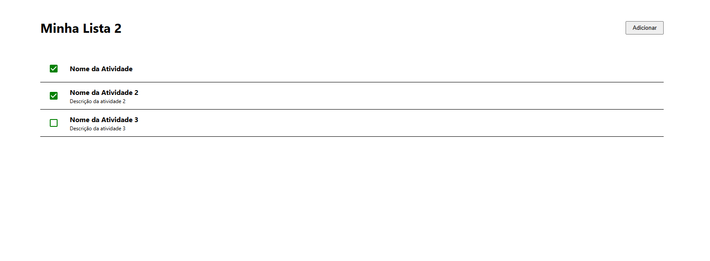

# TO-DO List 📝

Gerencie suas tarefas de forma simples e eficiente com o **TO-DO List**! Este projeto permite que você crie, edite e organize suas listas de atividades de maneira prática.

## 📖 Sobre o Projeto

O **TO-DO List** é uma aplicação que facilita a organização das suas tarefas do dia a dia. Com ele, você pode:

- **Criar, editar e excluir listas** personalizadas.
- **Adicionar, editar e excluir atividades** dentro de cada lista.

Ideal para quem deseja organizar a rotina de forma intuitiva e visual.

## 🎥 Demonstração

Aqui estão algumas telas da aplicação:

### Tela Inicial (Home)

### Tela de Listagem de Atividades

## 🛠️ Tecnologias Utilizadas

Este projeto foi desenvolvido utilizando as seguintes tecnologias:

- **[React](https://reactjs.org/):** Biblioteca JavaScript para construção de interfaces de usuário.
- **[React Material](https://mui.com/):** Componentes estilizados e prontos para uso.
- **[React Router DOM](https://reactrouter.com/):** Gerenciamento de rotas.
- **[Jest](https://jestjs.io/):** Framework de testes.
- **[Jotai](https://jotai.org/):** Gerenciamento de estado atômico.
- **Zustand:** Gerenciamento de estado leve e flexível.
- **TypeScript:** Tipagem estática para maior segurança no código.

## 🚀 Como Instalar e Rodar o Projeto

Siga os passos abaixo para rodar o projeto localmente:

1.  **Clone o repositório:**

    bash

    `git clone https://github.com/DevDanielSantiago/todo-list.git`

2.  **Entre na pasta do projeto:**

    `cd todo-list`

3.  **Instale as dependências:**

    `yarn install`

4.  **Inicie o servidor de desenvolvimento:**

    `yarn start`

Agora você pode acessar o projeto no navegador através do endereço: `http://localhost:3000`.

## 🧪 Como Rodar os Testes

Para rodar os testes e verificar a cobertura do código:

Copiar código

`yarn test`

Os testes são realizados com **Jest**, garantindo a qualidade e confiabilidade do código.

## 📬 Como Contribuir

Contribuições são bem-vindas! Para colaborar com o projeto:

1.  Faça um fork do repositório.
2.  Crie uma nova branch para a sua feature:

    Copiar código

    `git checkout -b minha-feature`

3.  Commit suas alterações:

    Copiar código

    `git commit -m 'Adicionei uma nova feature'`

4.  Faça o push para a branch:

    Copiar código

    `git push origin minha-feature`

5.  Abra um Pull Request.

## 📄 Licença

Este projeto está sob a licença **MIT**. Sinta-se à vontade para usá-lo e modificá-lo!
